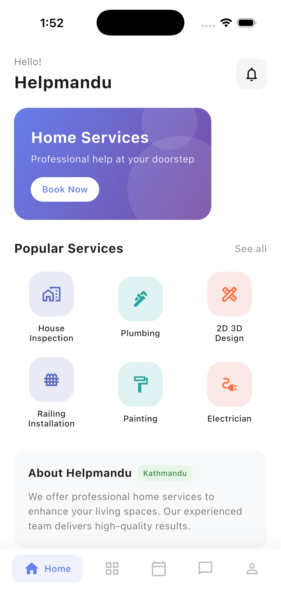
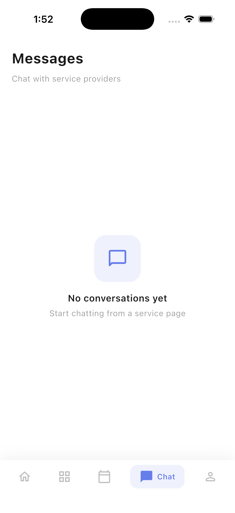
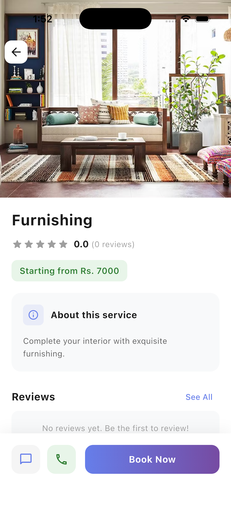

<div align="center">


# Helpmandu

### Your Trusted Home Services Marketplace in Kathmandu

[](https://flutter.dev)
[](https://dart.dev)
[](https://firebase.google.com)
[](LICENSE)

[]()
[]()
[]()

---

> **Status: Retired / Archived.** Built ~2023, no longer in active development or maintained. Kept public as a portfolio reference.

**Connect with skilled professionals for all your home improvement needs.**
From plumbing to painting, electrical work to interior design — book trusted service providers in just a few taps.

[Download App](#installation) · [View Demo](#screenshots) · [Report Bug](https://github.com/AayushBaniya2006/Helpmandu/issues)

</div>

---

## Screenshots

<div align="center">

| Landing Page | Messages | Service |
|:------------:|:--------:|:-------:|
|  |  |  |

</div>

---

## Features

<table>
<tr>
<td width="50%">

### Core Features

| Feature | Description |
|---------|-------------|
| **Secure Authentication** | Email/password & Google Sign-In via Firebase |
| **15+ Service Categories** | Plumbing, Painting, Electrical, and more |
| **One-Tap Calling** | Direct call to service providers |
| **Smart Booking** | Schedule with date & time selection |
| **In-App Chat** | Real-time messaging with providers |
| **Payment Gateway** | eSewa & Khalti integration |
| **Ratings & Reviews** | Rate and review completed services |
| **Booking History** | Track past and upcoming bookings |
| **Push Notifications** | Stay updated on booking status |
| **Multi-Language** | English & Nepali (नेपाली) support |

</td>
<td width="50%">

### Platform Support

| Platform | Status |
|----------|--------|
| Android | Ready |
| iOS | Ready |
| Web | Ready |
| macOS | Ready |
| Windows | Configured |
| Linux | Configured |

</td>
</tr>
</table>

---

## Available Services

<div align="center">

| | | | |
|:---:|:---:|:---:|:---:|
| **Plumbing** | **Painting** | **Electrical** | **Home Inspection** |
| **2D & 3D Design** | **UPVC Roofing** | **Smart Home** | **AC Repair** |
| **False Ceiling** | **Furnishing** | **Modular Kitchen** | **Bathroom Remodel** |
| **Glass Installation** | **Aluminum Work** | **Home Finishing** | **Hair Dresser** |

</div>

---

## Tech Stack

<div align="center">


</div>

| Category | Technology |
|----------|------------|
| **Framework** | Flutter 3.18+ with Dart 3.0+ |
| **Backend** | Firebase (Authentication, Realtime Database, Storage) |
| **Authentication** | Firebase Auth + Google Sign-In |
| **Communication** | Direct Calling + SMS Integration |
| **UI/UX** | Material Design 2 |

---

## Quick Start

### Prerequisites

- Flutter SDK `3.18.0` or higher
- Dart SDK `3.0.6` or higher
- Firebase project with Authentication enabled
- Android Studio / VS Code with Flutter extensions

### Installation

```bash
# Clone the repository
git clone https://github.com/AayushBaniya2006/Helpmandu.git

# Navigate to project directory
cd Helpmandu

# Install dependencies
flutter pub get

# Run the app
flutter run
```

### Firebase Configuration

1. Create a project at [Firebase Console](https://console.firebase.google.com)
2. Add Android, iOS, and Web apps to your project
3. Download configuration files:
   - `google-services.json` → `android/app/`
   - `GoogleService-Info.plist` → `ios/Runner/`
4. Enable Authentication providers (Email/Password, Google)

---

## Project Structure

```
lib/
├── main.dart                    # Application entry point
├── firebase_options.dart        # Firebase configuration
│
├── Pages/
│   ├── HomePage.dart            # Main tab controller
│   ├── MainPage.dart            # Featured services & home content
│   ├── ServicesPage.dart        # Complete service catalog
│   ├── accountPage.dart         # User profile management
│   └── Do Not Change/           # Authentication pages
│       ├── auth_page.dart       # Auth state management
│       ├── LoginPage.dart       # Login UI
│       └── registerPage.dart    # Registration UI
│
├── Components/
│   ├── auth_services.dart       # Google Sign-In service
│   ├── ServiceDesc.dart         # Service detail view
│   ├── booking.dart             # Booking flow & SMS
│   ├── build_grid.dart          # Service grid builder
│   ├── button.dart              # Custom button widget
│   ├── my_textfield.dart        # Custom text field
│   └── square_tile.dart         # Social login tiles
│
└── images/                      # App assets & service images
```

---

## Development

> Helpmandu was built through multiple development cycles before the project was paused in 2023. The codebase has since been consolidated into this clean, archived snapshot.

---

## Roadmap

- [x] Core app functionality
- [x] Firebase Authentication
- [x] Google Sign-In integration
- [x] Service catalog with 15+ categories
- [x] Direct calling feature
- [x] SMS booking system
- [x] Cross-platform support
- [x] Push notifications (Firebase Cloud Messaging)
- [x] In-app chat with providers
- [x] Payment gateway integration (eSewa & Khalti)
- [x] Service provider ratings & reviews
- [x] Booking history & management
- [x] Multi-language support (English & Nepali)

---

## Contributing

Contributions are welcome! Here's how you can help:

1. **Fork** the repository
2. **Create** a feature branch (`git checkout -b feature/AmazingFeature`)
3. **Commit** your changes (`git commit -m 'Add AmazingFeature'`)
4. **Push** to the branch (`git push origin feature/AmazingFeature`)
5. **Open** a Pull Request

Please read our contributing guidelines before submitting PRs.

---

## License

Distributed under the MIT License. See [`LICENSE`](LICENSE) for more information.

---

<div align="center">

### Built with Flutter for Nepal


**[Aayush Baniya](https://github.com/AayushBaniya2006)**

[](https://github.com/AayushBaniya2006)

---

If you found this project helpful, please consider giving it a star!

</div>
